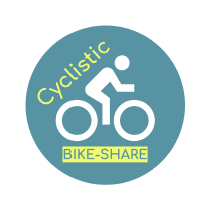

# GoogleCapstone: Cyclistic
Cylistic, a bike-share company in Chicago, wants to know who annual members and casual riders are different. They have concluded that members are more profitable for the company and so they want to encourage casual riders to become members. The project description can be found [here](Description.pdf). 
First, we downloaded the data from [link](https://divvy-tripdata.s3.amazonaws.com/index.html). Data include the rider information from July 2013 - Dec 2021. All data are downloded and tranferred into SQL using SSIS and SSMS tools. 
